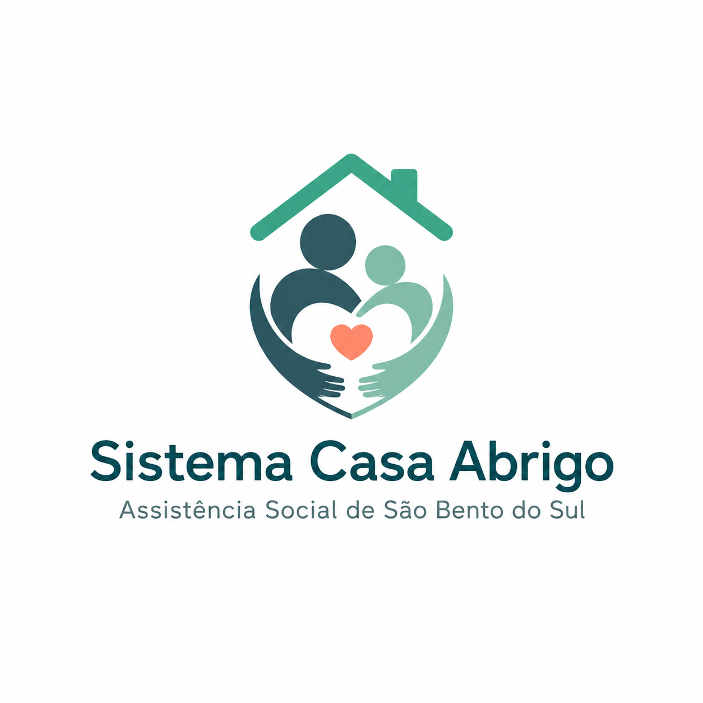

<p align="center">
  
</p>

<h1 align="center">Sistema Casa Abrigo</h1>
<p align="center">Assistência Social de São Bento do Sul</p>

<p align="center">
  
  
  
  
</p>

---

Plataforma web desenvolvida para apoiar a gestão da Casa Abrigo Temporário da SEMAS, centralizando o acompanhamento de pessoas acolhidas, famílias, setores, materiais e entregas em um único ambiente seguro, organizado e preparado para uso operacional no dia a dia.

## Contexto do projeto

A rotina de uma casa abrigo exige agilidade, rastreabilidade e cuidado com cada decisão. Informações espalhadas em planilhas, anotações soltas ou controles manuais aumentam o risco de erro, dificultam o trabalho em equipe e tornam o acompanhamento mais lento do que deveria ser.

Este sistema nasce para resolver esse problema com uma solução digital única, capaz de organizar o fluxo de acolhimento e apoiar a equipe técnica com dados confiáveis, acessíveis e atualizados em tempo real.

## Importância social

Mais do que um sistema administrativo, esta plataforma representa uma ferramenta de suporte para a proteção social. Quando o registro de entradas, saídas, setores, distribuição de materiais e movimentações internas fica centralizado, a equipe ganha clareza para tomar decisões com mais segurança e transparência.

Na prática, isso fortalece:

- a organização do acolhimento;
- o acompanhamento individual e familiar;
- a distribuição de responsabilidades entre perfis de acesso;
- a rastreabilidade de movimentações e entregas;
- a agilidade na rotina da equipe;
- a qualidade da informação utilizada na gestão.

## Principais funcionalidades

### Acolhidos
- Cadastro e edição de dados pessoais e operacionais
- Vínculo com família e setor
- Controle de entrada e saída
- Identificação por código de pulseira

### Famílias
- Registro de núcleo familiar
- Acompanhamento do status e movimentação
- Saída operacional com histórico

### Setores
- Cadastro de setores internos com cor e capacidade
- Visualização rápida da ocupação

### Materiais e entregas
- Cadastro de materiais
- Registro de entregas com rastreabilidade

### Administração
- Gerenciamento de usuários
- Perfis de acesso com permissão por função
- Rotas protegidas no backend e no frontend

## Stack tecnológica

| Camada | Tecnologias |
|---|---|
| Backend | Laravel 13, PHP 8.3, Sanctum, PostgreSQL |
| Frontend | React 19, TypeScript, Vite, Material UI |
| Deploy | Render (API) + Vercel (Frontend) |
| Banco de dados | Supabase (PostgreSQL) |

## Estrutura do projeto

```text
.
├── backend/          # API Laravel
├── Frontend/         # Aplicação React + TypeScript
├── docs/             # Documentação complementar
└── render.yaml       # Configuração de deploy
```

## Perfis de acesso

| Perfil | Permissões |
|---|---|
| Admin | Acesso total, incluindo gestão de usuários e setores |
| Técnico | Acesso operacional a cadastros, dashboards e consultas |

## Rotas principais da API

```
POST   /api/login
GET    /api/me
POST   /api/logout
GET    /api/dashboard
GET    /api/setores
POST   /api/setores          (admin)
PATCH  /api/setores/{id}     (admin)
DELETE /api/setores/{id}     (admin)
GET    /api/acolhidos
POST   /api/acolhidos
PATCH  /api/acolhidos/{id}
GET    /api/familias
POST   /api/familias
PATCH  /api/familias/{id}
GET    /api/materiais
POST   /api/materiais
GET    /api/entregas
POST   /api/entregas
GET    /api/admin/users      (admin)
POST   /api/admin/users      (admin)
PATCH  /api/admin/users/{id} (admin)
DELETE /api/admin/users/{id} (admin)
```

## Requisitos de ambiente

- Node.js 18+
- PHP 8.3+
- Composer

## Instalação

```bash
# Clone o repositório
git clone https://github.com/evvandro/SEMAS-CASA-ABRIGO.git
cd SEMAS-CASA-ABRIGO

# Instale as dependências
npm run install:all

# Configure o backend
cp backend/.env.example backend/.env
# Preencha as variáveis de ambiente

# Execute as migrações
cd backend && php artisan migrate --force && php artisan db:seed --force
```

## Execução em desenvolvimento

```bash
# Tudo junto
npm run dev

# Separado
cd backend && php artisan serve
cd Frontend && npm run dev
```

## Licença

Este repositório é público para consulta e apresentação, mas o código, a identidade visual, os textos e a estrutura do projeto não podem ser copiados, reutilizados, redistribuídos ou modificados sem autorização prévia e expressa da equipe responsável.
